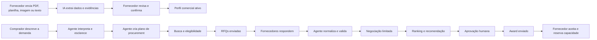
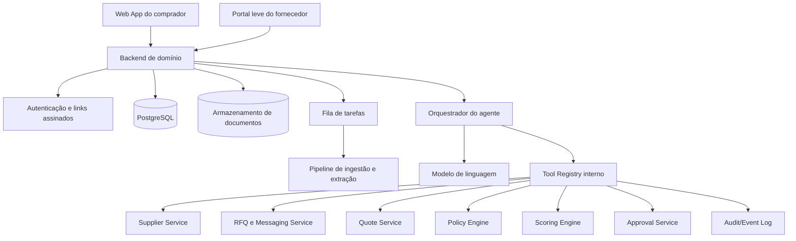

# PRD Técnico — Canal Agente

**Versão:** 1.0  
**Data:** 19 de agosto de 2026  
**Status:** Escopo proposto para hackathon  
**Vertical inicial:** Procurement de alimentação para eventos corporativos  
**Resultado central:** uma necessidade de compra real é transformada em uma cotação comparável, aprovada e aceita por um fornecedor real.

---

## 1. Resumo executivo

O **Canal Agente** é uma plataforma de procurement com um **agente comprador nativo**, responsável por conduzir o processo de cotação de ponta a ponta.

A plataforma conecta dois lados que hoje operam de forma fragmentada:

1. **Empresas que precisam comprar**, mas ainda executam sourcing, cotações e comparações manualmente.
2. **Pequenos fornecedores**, que normalmente vendem por WhatsApp, PDF, planilha, catálogo ou indicação e não possuem infraestrutura digital estruturada.

O fornecedor envia os materiais que já utiliza. A IA extrai e organiza preços, capacidade, cobertura, condições comerciais, restrições, prazo, emissão de nota fiscal e demais informações relevantes. O fornecedor revisa e confirma esses dados por meio de um link simples.

Dentro da própria plataforma, o comprador descreve sua necessidade em linguagem natural. O **agente de procurement interno** interpreta a demanda, esclarece informações faltantes, encontra fornecedores elegíveis, cria e envia RFQs, acompanha respostas, normaliza propostas, negocia dentro de limites pré-autorizados, aplica critérios objetivos e conduz a solicitação até uma decisão de compra aprovada por uma pessoa.

No MVP, **não haverá MCP, API pública ou conexão de agentes externos**. Toda a experiência acontecerá dentro do Canal Agente. A interoperabilidade poderá ser adicionada futuramente, mas não é necessária para provar o valor central do produto.

---

## 2. Definição do produto

> **O Canal Agente é um agente de procurement que transforma fornecedores desestruturados em opções compráveis e conduz uma necessidade corporativa desde o briefing até uma cotação aceita e pronta para contratação.**

### 2.1 O que o produto não é

- Não é um novo e-commerce.
- Não é um marketplace tradicional baseado apenas em listagem de fornecedores.
- Não é apenas um chatbot que recomenda fornecedores.
- Não é apenas um extrator de PDFs.
- Não é um portal corporativo pesado de cadastro de fornecedores.
- Não é somente um MCP ou uma API para outros agentes.
- Não substitui políticas de compliance, jurídico, financeiro ou homologação da empresa compradora.
- Não realiza pagamento no MVP.

### 2.2 Mudança em relação à concepção anterior

A concepção anterior priorizava tornar fornecedores consultáveis por agentes externos. Nesta versão:

- o agente está **dentro da plataforma**;
- o comprador interage diretamente com o agente;
- o agente conduz o processo operacional de procurement;
- os fornecedores continuam acessíveis por um fluxo simples de confirmação e resposta;
- a plataforma assume a responsabilidade de orquestrar sourcing, RFQ, follow-up, equalização, negociação limitada, aprovação e award;
- conectores externos deixam de ser requisito do MVP.

---

## 3. Problema

### 3.1 Problema do comprador

Times corporativos frequentemente compram alimentação, brindes, materiais e serviços para eventos por meio de processos informais:

1. consultam fornecedores já conhecidos;
2. recuperam contatos antigos;
3. enviam mensagens repetitivas;
4. recebem propostas em formatos diferentes;
5. verificam manualmente preço, disponibilidade, prazo e restrições;
6. organizam as respostas em planilhas;
7. pedem novas informações quando algum item ficou ambíguo;
8. encaminham a opção escolhida para aprovação ou cadastro.

Esse processo reduz a descoberta de novos fornecedores, consome tempo e dificulta uma comparação auditável.

### 3.2 Problema do fornecedor

Pequenos fornecedores podem ter boa qualidade, preço e capacidade, mas permanecem invisíveis porque:

- vendem por WhatsApp ou indicação;
- possuem apenas cardápios em PDF ou imagem;
- não mantêm estoque ou disponibilidade em APIs;
- não possuem catálogo normalizado;
- não conseguem acompanhar plataformas complexas de procurement;
- têm pouco incentivo para pagar taxas altas de marketplaces;
- não aparecem nas ferramentas utilizadas por compradores corporativos.

### 3.3 Problema de produto a ser resolvido

> Como permitir que uma empresa descreva uma necessidade de compra uma única vez e tenha um agente capaz de encontrar, acionar, comparar e conduzir fornecedores reais até uma decisão de procurement, sem inventar respostas e sem exigir que o pequeno fornecedor adote uma nova operação complexa?

---

## 4. Vertical inicial

### 4.1 Recorte recomendado

**Alimentação para eventos corporativos em São Paulo**, começando por:

- coffee breaks;
- kits individuais;
- café da manhã corporativo;
- almoço e refeições para grupos;
- opções vegetarianas, veganas e sem glúten.

### 4.2 Por que este recorte

- A demanda possui prazo, orçamento e quantidade claros.
- Disponibilidade precisa ser confirmada para uma data específica.
- Existem restrições verificáveis.
- Muitos fornecedores operam por WhatsApp, PDF e indicação.
- A proposta é fácil de entender em uma demonstração.
- O resultado pode ser confirmado sem processar pagamento.
- O caso existe no contexto real de organização de eventos corporativos.

### 4.3 Exemplo de requisição

> “Preciso de um coffee break para 80 pessoas na próxima sexta-feira, entregue às 8h30 na Vila Olímpia. Teremos 12 vegetarianos, 4 veganos e 3 pessoas com restrição a glúten. O orçamento máximo é R$ 4.500. É obrigatório emitir nota fiscal e evitar descartáveis plásticos.”

---

## 5. Objetivos

### 5.1 Objetivos do MVP

1. Transformar materiais desestruturados de fornecedores em perfis comerciais estruturados e rastreáveis.
2. Permitir que o fornecedor confirme ou corrija os dados extraídos.
3. Receber uma solicitação de compra em linguagem natural.
4. Fazer o agente interpretar a solicitação e identificar informações faltantes.
5. Fazer sourcing em uma base de fornecedores reais.
6. Enviar RFQs reais para fornecedores elegíveis.
7. Receber e normalizar propostas em formatos diferentes.
8. Permitir negociação limitada e auditável pelo agente.
9. Aplicar regras objetivas de elegibilidade e ranking.
10. Solicitar aprovação humana antes de selecionar um fornecedor.
11. Registrar o aceite do fornecedor selecionado e uma reserva de capacidade, horário ou atendimento.
12. Exibir uma trilha completa de decisões, mensagens, evidências e mudanças de estado.

### 5.2 Não objetivos do MVP

- Processar pagamento.
- Emitir nota fiscal.
- Integrar-se a ERP corporativo.
- Substituir homologação jurídica ou compliance.
- Atender todas as categorias de procurement.
- Criar um marketplace público com milhares de fornecedores.
- Permitir que agentes externos acessem a plataforma.
- Negociar contratos complexos de forma autônoma.
- Aprovar gastos sem intervenção humana.
- Alegar economia financeira sem uma base comparável real.

---

## 6. Personas

### 6.1 Solicitante corporativo

Pessoa de eventos, inovação, marketing, RH ou operações que precisa contratar um fornecedor.

**Necessidades:**

- descrever a demanda rapidamente;
- receber opções comparáveis;
- saber quais requisitos estão ou não atendidos;
- reduzir mensagens e follow-ups manuais;
- manter evidências para aprovação.

### 6.2 Aprovador de procurement

Pessoa responsável por aprovar a escolha, o orçamento ou o encaminhamento do fornecedor.

**Necessidades:**

- visualizar critérios objetivos;
- verificar propostas e fontes;
- entender riscos e pendências;
- aprovar, rejeitar ou pedir nova rodada;
- impedir ações fora da política.

### 6.3 Pequeno fornecedor

Buffet, padaria, cozinha, confeitaria ou empresa de alimentação que atende eventos, mas não possui integração digital sofisticada.

**Necessidades:**

- entrar usando os materiais que já possui;
- corrigir dados sem treinamento complexo;
- receber solicitações claras;
- responder rapidamente pelo celular;
- saber exatamente o que está sendo pedido;
- não pagar por uma infraestrutura de e-commerce completa.

### 6.4 Agente de procurement

Agente nativo da plataforma que atua em nome do comprador dentro de limites definidos.

**Responsabilidades:**

- entender a necessidade;
- montar o plano de compra;
- procurar fornecedores;
- enviar e acompanhar RFQs;
- esclarecer respostas;
- normalizar propostas;
- negociar dentro de políticas autorizadas;
- produzir recomendação explicável;
- pedir aprovação;
- comunicar award e registrar o aceite do fornecedor.

---

## 7. Princípios de produto

### 7.1 O agente deve agir, não apenas conversar

A interface conversacional é somente um meio de controle. O valor está nas ações verificáveis executadas pelo agente.

### 7.2 Toda informação comercial crítica precisa de evidência

Preço, capacidade, validade, prazo, taxa, disponibilidade e emissão de NF devem indicar:

- fonte original;
- trecho ou campo de origem;
- nível de confiança;
- quem confirmou;
- data da confirmação;
- data de validade.

### 7.3 A IA interpreta; regras determinísticas decidem limites

A IA pode interpretar documentos e mensagens. Ela não pode inventar confirmações, aprovar compras ou ultrapassar políticas.

### 7.4 Mudanças de estado dependem de eventos reais

Um processo só muda para “cotação recebida”, “aprovado” ou “aceito” quando existe um evento verificável correspondente.

### 7.5 O fornecedor não deve migrar sua operação

O fornecedor pode responder por um link simples e seguro, sem criar uma conta complexa ou operar um portal completo.

### 7.6 A autonomia deve ser delimitada

O agente pode executar tarefas repetitivas, mas decisões financeiras e compromissos externos exigem aprovação humana quando ultrapassarem limites configurados.

---

## 8. Escopo funcional ponta a ponta



---

## 9. Fluxo principal do comprador

### Etapa 1 — Criação da requisição

O comprador informa sua necessidade por chat ou formulário.

O agente converte o texto em um objeto estruturado contendo:

- categoria;
- descrição;
- quantidade;
- data;
- horário;
- endereço ou região;
- orçamento máximo;
- restrições obrigatórias;
- preferências;
- necessidade de NF;
- critérios de sustentabilidade;
- prazo para resposta;
- responsável pela aprovação.

### Etapa 2 — Clarificação

O agente verifica campos obrigatórios. Caso falte uma informação que impeça a execução, ele faz uma pergunta objetiva.

Exemplo:

> “Para confirmar taxa e cobertura de entrega, preciso do endereço ou ao menos do bairro do evento.”

O agente não deve iniciar a RFQ enquanto faltarem campos obrigatórios.

### Etapa 3 — Plano de procurement

Antes de agir, o agente mostra um plano resumido:

- categoria identificada;
- quantidade de fornecedores a consultar;
- critérios eliminatórios;
- estratégia de sourcing;
- política de negociação;
- prazo de conclusão;
- ponto de aprovação humana.

O comprador pode editar as políticas antes da execução.

### Etapa 4 — Sourcing

O agente busca fornecedores na base interna usando:

1. categoria e taxonomia;
2. busca semântica para ampliar recall;
3. filtros determinísticos para restrições obrigatórias;
4. status de confirmação e validade dos dados;
5. histórico de resposta, quando disponível.

Fornecedores com dados incompletos podem ser acionados para atualização, mas não devem ser apresentados como elegíveis antes da confirmação.

### Etapa 5 — RFQ

O agente cria uma RFQ estruturada, consistente e igual para todos os fornecedores selecionados.

A RFQ contém:

- demanda completa;
- data e horário;
- endereço;
- quantidade;
- restrições;
- exigências obrigatórias;
- campos que o fornecedor deve responder;
- prazo de validade da proposta;
- prazo máximo de resposta;
- link seguro para resposta.

### Etapa 6 — Follow-up

Caso um fornecedor não responda dentro da janela definida, o agente pode enviar follow-ups automáticos, respeitando:

- número máximo de tentativas;
- intervalo mínimo;
- horário comercial;
- opt-out do fornecedor;
- canal permitido.

### Etapa 7 — Recebimento e normalização

O fornecedor informa ou confirma:

- disponibilidade;
- preço unitário;
- preço total;
- taxa de entrega;
- itens incluídos;
- substituições;
- capacidade;
- atendimento das restrições;
- emissão de NF;
- validade da cotação;
- condições de cancelamento;
- observações.

O agente normaliza as propostas em um mesmo formato, sem alterar o conteúdo comercial original.

### Etapa 8 — Negociação limitada

Quando habilitado pelo comprador, o agente pode negociar com base em limites explícitos.

Exemplo de política:

```yaml
negotiation:
  enabled: true
  target_total_price: 4100
  maximum_total_price: 4500
  maximum_rounds: 2
  allowed_topics:
    - total_price
    - delivery_fee
    - included_items
    - payment_term
  forbidden_actions:
    - invent_competing_offer
    - disclose_other_supplier_identity
    - commit_without_approval
    - change_mandatory_requirements
```

O agente não pode mentir sobre ofertas concorrentes, inventar urgência ou assumir compromissos não autorizados.

### Etapa 9 — Equalização e ranking

O agente apresenta:

- critérios obrigatórios atendidos ou não;
- preço total;
- preço por pessoa;
- taxa de entrega;
- itens incluídos;
- restrições atendidas;
- prazo de resposta;
- validade;
- documentos e pendências;
- riscos;
- evidências.

A pontuação é calculada por regras configuráveis, não pela opinião livre do modelo.

### Etapa 10 — Aprovação humana

O agente recomenda uma opção e explica a recomendação. O aprovador pode:

- aprovar;
- rejeitar;
- selecionar outra proposta;
- alterar critérios;
- abrir uma nova rodada;
- solicitar esclarecimento;
- cancelar o processo.

### Etapa 11 — Award e aceite

Após aprovação, o agente envia ao fornecedor selecionado um aviso de award com os termos aprovados.

O fornecedor precisa aceitar explicitamente. O aceite gera:

- confirmação da proposta;
- reserva de capacidade ou horário;
- registro da versão final dos termos;
- timestamp;
- identidade do responsável;
- hash do payload aceito.

Os demais fornecedores recebem uma comunicação de encerramento, quando permitido.

### Etapa 12 — Handoff

O processo termina como **pronto para contratação**, contendo:

- fornecedor escolhido;
- proposta final;
- evidências;
- aceite do fornecedor;
- pendências de homologação;
- documentos recebidos;
- resumo para procurement ou financeiro.

Pagamento, contrato e emissão fiscal ficam fora do MVP.

---

## 10. Fluxo de onboarding do fornecedor

### 10.1 Entrada aceita

- PDF;
- imagem;
- planilha;
- texto copiado de WhatsApp;
- cardápio;
- proposta antiga;
- formulário manual.

### 10.2 Extração

A IA extrai campos e mantém a proveniência de cada valor.

Exemplo:

```json
{
  "field": "minimum_people",
  "value": 30,
  "unit": "people",
  "source_document": "cardapio_agosto.pdf",
  "source_excerpt": "Eventos atendidos a partir de 30 pessoas",
  "confidence": 0.96,
  "confirmed_by_supplier": false,
  "confirmed_at": null
}
```

### 10.3 Revisão

O fornecedor recebe uma tela simples com:

- campo extraído;
- valor sugerido;
- fonte;
- opção de confirmar;
- opção de corrigir;
- opção de marcar como não aplicável.

### 10.4 Ativação

O perfil só se torna elegível para RFQs quando os campos mínimos forem confirmados.

Campos mínimos para alimentação:

- identidade comercial;
- contato;
- categoria;
- região atendida;
- quantidade mínima;
- capacidade aproximada;
- antecedência mínima;
- emissão de NF;
- restrições atendidas;
- forma de precificação;
- data de atualização.

---

## 11. Escopo do agente de procurement

### 11.1 Capacidades obrigatórias

| Capacidade | Descrição | Pode agir autonomamente? |
|---|---|---:|
| Interpretar requisição | Converter linguagem natural em campos estruturados | Sim |
| Pedir esclarecimentos | Perguntar somente o que bloqueia o processo | Sim |
| Criar plano | Definir etapas e critérios para a rodada | Sim, com revisão do comprador |
| Buscar fornecedores | Consultar a base interna | Sim |
| Aplicar elegibilidade | Eliminar opções incompatíveis por regras | Sim |
| Criar RFQ | Gerar solicitação estruturada | Sim |
| Enviar RFQ | Disparar para fornecedores selecionados | Sim, após requisição pronta |
| Fazer follow-up | Cobrar resposta dentro da política | Sim |
| Interpretar resposta | Extrair termos de mensagens e anexos | Sim |
| Solicitar correção | Perguntar ao fornecedor sobre ambiguidades | Sim |
| Normalizar propostas | Converter respostas para schema comum | Sim |
| Negociar | Negociar dentro de limites explícitos | Sim, quando habilitado |
| Rankear propostas | Aplicar fórmula configurada | Sim |
| Recomendar fornecedor | Explicar a melhor alternativa | Sim |
| Aprovar gasto | Comprometer a empresa | Não |
| Enviar award | Comunicar seleção | Somente após aprovação humana |
| Registrar aceite | Gravar confirmação do fornecedor | Sim, após evento real |
| Processar pagamento | Debitar ou transferir recursos | Não no MVP |

### 11.2 Ferramentas internas do agente

O agente deve acessar somente ferramentas tipadas e autorizadas:

```text
create_procurement_request
update_procurement_request
get_missing_required_fields
search_suppliers
get_supplier_profile
get_supplier_evidence
create_rfq_round
select_rfq_recipients
send_rfq
get_rfq_delivery_status
send_supplier_follow_up
parse_supplier_response
request_supplier_clarification
validate_quote
normalize_quote
compare_quotes
run_negotiation_round
calculate_supplier_score
create_recommendation
request_human_approval
send_award
send_rejection_notice
record_supplier_acceptance
create_capacity_reservation
close_procurement_process
```

### 11.3 Ações proibidas

O agente não pode:

- inventar fornecedores;
- inventar respostas;
- marcar uma RFQ como enviada sem confirmação do serviço de entrega;
- marcar uma cotação como recebida sem evento de entrada;
- afirmar que uma informação foi confirmada quando foi apenas extraída;
- prometer pagamento;
- aprovar o próprio plano de compra;
- ultrapassar orçamento;
- alterar restrições obrigatórias para facilitar o matching;
- revelar dados confidenciais de um fornecedor a outro;
- simular concorrência;
- apresentar economia não comprovada;
- alterar a pontuação depois de conhecer o fornecedor vencedor;
- assumir que “sem glúten” significa ausência certificada de contaminação cruzada sem confirmação explícita.

---

## 12. Níveis de autonomia

### Nível 0 — Assistente

Somente interpreta, organiza e recomenda. Não envia mensagens.

### Nível 1 — Executor operacional

Envia RFQs, solicita esclarecimentos e acompanha respostas.

### Nível 2 — Negociador limitado

Pode negociar preço e condições dentro de uma política explícita.

### Nível 3 — Executor com aprovação

Após aprovação humana, envia award e registra o aceite do fornecedor.

### Configuração do MVP

O MVP deve operar em **Nível 2 durante a cotação** e **Nível 3 após aprovação humana**.

---

## 13. Requisitos funcionais

### 13.1 Gestão de fornecedores

#### FR-SUP-001 — Ingestão de materiais

O sistema deve permitir upload de PDF, imagem e planilha, além de entrada de texto.

**Critérios de aceitação:**

- o arquivo é armazenado com identificador único;
- o tipo e o hash do arquivo são registrados;
- o processamento gera status visível;
- falhas não apagam o documento original.

#### FR-SUP-002 — Extração com proveniência

Cada campo extraído deve guardar fonte e confiança.

**Critérios de aceitação:**

- campos sem evidência são marcados como `not_found`;
- nenhuma informação crítica é preenchida silenciosamente por inferência;
- o usuário consegue abrir o trecho de origem.

#### FR-SUP-003 — Confirmação pelo fornecedor

O fornecedor deve confirmar ou corrigir dados por link seguro.

**Critérios de aceitação:**

- o link possui expiração;
- mudanças são versionadas;
- a identidade ou canal do confirmador é registrado;
- o estado muda apenas após submissão real.

#### FR-SUP-004 — Status de elegibilidade

O sistema deve impedir o uso de fornecedores sem dados mínimos confirmados.

---

### 13.2 Requisição de compra

#### FR-REQ-001 — Entrada em linguagem natural

O comprador deve poder descrever a necessidade em texto livre.

#### FR-REQ-002 — Estruturação visível

O sistema deve mostrar os campos interpretados antes do início da rodada.

#### FR-REQ-003 — Clarificação bloqueante

O agente deve perguntar por informações obrigatórias ausentes.

#### FR-REQ-004 — Políticas de execução

O comprador deve definir ou aceitar:

- orçamento máximo;
- quantidade desejada de cotações;
- critérios eliminatórios;
- prazo de resposta;
- possibilidade de negociação;
- quantidade máxima de rodadas;
- pessoa aprovadora.

---

### 13.3 Sourcing e RFQ

#### FR-RFQ-001 — Seleção explicável

O sistema deve mostrar por que cada fornecedor foi incluído ou excluído.

#### FR-RFQ-002 — Criação de rodada

O agente deve criar uma rodada com versionamento dos requisitos.

#### FR-RFQ-003 — Envio real

O status `RFQ_SENT` só pode ser atribuído após confirmação do canal de entrega.

#### FR-RFQ-004 — Link de resposta

Cada fornecedor deve receber um link individual, seguro e rastreável.

#### FR-RFQ-005 — Follow-up controlado

O agente deve respeitar limites de frequência e quantidade.

---

### 13.4 Cotação e negociação

#### FR-QUO-001 — Resposta estruturada

O fornecedor deve poder preencher preço, condições e disponibilidade.

#### FR-QUO-002 — Anexos

O fornecedor deve poder anexar uma proposta formal.

#### FR-QUO-003 — Normalização

O sistema deve calcular preço total, preço por pessoa e custos adicionais usando funções determinísticas.

#### FR-QUO-004 — Validação

Uma cotação só pode ser considerada válida quando tiver:

- preço;
- disponibilidade;
- itens incluídos;
- validade;
- atendimento ou não das restrições;
- identidade do respondente.

#### FR-NEG-001 — Negociação limitada

O agente deve negociar somente atributos autorizados.

#### FR-NEG-002 — Histórico de rodadas

Toda contraproposta deve manter versões anteriores.

---

### 13.5 Comparação, aprovação e award

#### FR-CMP-001 — Matriz de comparação

O sistema deve mostrar propostas em colunas comparáveis.

#### FR-CMP-002 — Critérios eliminatórios

Fornecedores que não atendam requisitos obrigatórios devem ser destacados e não podem vencer automaticamente.

#### FR-CMP-003 — Ranking determinístico

A pontuação deve ser calculada por pesos visíveis.

#### FR-APR-001 — Aprovação humana

O sistema deve impedir o envio de award sem aprovação registrada.

#### FR-AWD-001 — Award versionado

O award deve referenciar a versão exata da proposta aprovada.

#### FR-AWD-002 — Aceite do fornecedor

O processo só pode mudar para `SUPPLIER_ACCEPTED` após confirmação real.

#### FR-AWD-003 — Reserva

O fornecedor deve poder confirmar a reserva de capacidade, produção, data ou horário.

---

### 13.6 Auditoria

#### FR-AUD-001 — Event log

Toda ação deve registrar:

- evento;
- ator;
- timestamp;
- entidade afetada;
- estado anterior;
- estado novo;
- payload relevante;
- origem da ação;
- identificador de execução do agente.

#### FR-AUD-002 — Explicação da recomendação

A recomendação deve separar:

- fatos confirmados;
- cálculo determinístico;
- interpretação produzida pela IA;
- riscos e pendências.

---

## 14. Regras de elegibilidade

### 14.1 Requisitos obrigatórios para o caso de alimentação

- fornecedor ativo;
- CNPJ informado;
- emissão de NF confirmada;
- região de entrega compatível;
- disponibilidade na data;
- capacidade suficiente;
- antecedência compatível;
- atendimento das restrições obrigatórias;
- preço total dentro do limite, quando o orçamento for eliminatório;
- proposta dentro da validade.

### 14.2 Critérios de ranking sugeridos

| Critério | Peso inicial |
|---|---:|
| Preço total | 35% |
| Atendimento das restrições | 20% |
| Adequação de itens e quantidade | 15% |
| Logística e horário | 10% |
| Prazo de resposta | 5% |
| Sustentabilidade | 5% |
| Completude documental | 5% |
| Histórico interno | 5% |

Os pesos devem ser configuráveis por processo.

### 14.3 Exemplo de cálculo

```text
Fornecedor A

Elegibilidade: 8/8 critérios obrigatórios

Preço total:                 32/35
Restrições:                  20/20
Adequação:                   13/15
Logística:                    9/10
Prazo de resposta:            5/5
Sustentabilidade:             4/5
Documentação:                 4/5
Histórico:                    3/5

Score final: 90/100
```

A IA pode explicar o score, mas não pode alterá-lo.

---

## 15. Máquinas de estado

### 15.1 Fornecedor

```text
DRAFT
  -> MATERIALS_UPLOADED
  -> EXTRACTED
  -> AWAITING_SUPPLIER_REVIEW
  -> CONFIRMED
  -> ACTIVE
  -> SUSPENDED | EXPIRED
```

### 15.2 Requisição de procurement

```text
DRAFT
  -> NEEDS_CLARIFICATION
  -> READY
  -> SOURCING
  -> RFQ_ACTIVE
  -> QUOTES_UNDER_REVIEW
  -> NEGOTIATING
  -> AWAITING_APPROVAL
  -> APPROVED
  -> AWARD_SENT
  -> SUPPLIER_ACCEPTED
  -> READY_FOR_CONTRACTING
  -> CLOSED
```

Estados alternativos:

```text
CANCELLED
NO_ELIGIBLE_SUPPLIERS
NO_VALID_QUOTES
APPROVAL_REJECTED
SUPPLIER_DECLINED_AWARD
EXPIRED
```

### 15.3 Cotação

```text
REQUESTED
  -> OPENED
  -> DRAFT_RESPONSE
  -> SUBMITTED
  -> VALIDATING
  -> NEEDS_CLARIFICATION
  -> VALID
  -> NEGOTIATING
  -> FINAL
  -> SELECTED | REJECTED | EXPIRED
```

### 15.4 Regra de transição

A LLM nunca atualiza estados diretamente. Ela solicita uma ação a uma ferramenta, e a camada de domínio valida se o evento necessário ocorreu.

---

## 16. Modelo de dados mínimo

### 16.1 Entidades principais

- `Organization`
- `User`
- `Supplier`
- `SupplierContact`
- `SupplierCapability`
- `SupplierOffer`
- `SourceDocument`
- `ExtractedField`
- `Confirmation`
- `ProcurementRequest`
- `Requirement`
- `ProcurementPolicy`
- `AgentRun`
- `AgentAction`
- `RFQRound`
- `RFQRecipient`
- `SupplierMessage`
- `Quote`
- `QuoteLineItem`
- `NegotiationRound`
- `Scorecard`
- `Approval`
- `Award`
- `SupplierAcceptance`
- `CapacityReservation`
- `AuditEvent`

### 16.2 Campos críticos da requisição

```json
{
  "id": "pr_123",
  "category": "corporate_catering",
  "event_date": "2026-08-28",
  "delivery_time": "08:30",
  "location": {
    "city": "São Paulo",
    "district": "Vila Olímpia"
  },
  "people_count": 80,
  "budget": {
    "currency": "BRL",
    "maximum_total": 4500
  },
  "dietary_requirements": {
    "vegetarian": 12,
    "vegan": 4,
    "gluten_free": 3
  },
  "mandatory_requirements": [
    "invoice_required",
    "no_single_use_plastic"
  ],
  "approval_required": true
}
```

### 16.3 Campos críticos da cotação

```json
{
  "id": "quote_456",
  "supplier_id": "supplier_789",
  "rfq_round_id": "rfq_101",
  "availability_confirmed": true,
  "subtotal": 4080,
  "delivery_fee": 120,
  "total": 4200,
  "currency": "BRL",
  "price_per_person": 52.5,
  "valid_until": "2026-08-20T18:00:00-03:00",
  "invoice_available": true,
  "requirements": {
    "vegetarian": "met",
    "vegan": "met",
    "gluten_free": "met_with_cross_contamination_warning"
  },
  "supplier_confirmed_at": "2026-08-19T15:41:22-03:00"
}
```

---

## 17. Arquitetura técnica proposta



### 17.1 Componentes

#### Frontend do comprador

- chat do agente;
- formulário estruturado da requisição;
- plano de execução;
- timeline do processo;
- painel de fornecedores encontrados;
- matriz de comparação;
- tela de aprovação;
- trilha de auditoria.

#### Portal do fornecedor

- revisão do perfil;
- resposta à RFQ;
- envio de anexos;
- contraproposta;
- aceite do award;
- reserva de capacidade.

#### Backend de domínio

Responsável por entidades, estados, políticas e validações. O backend é a fonte de verdade, não o modelo.

#### Orquestrador do agente

Responsável por:

- interpretar intenção;
- selecionar ferramentas;
- acompanhar o plano;
- recuperar contexto;
- solicitar aprovação;
- lidar com falhas e retries;
- impedir ações não autorizadas.

#### Policy Engine

Executa regras determinísticas sobre:

- orçamento;
- limites de negociação;
- horários de envio;
- quantidade de follow-ups;
- campos obrigatórios;
- critérios eliminatórios;
- necessidade de aprovação.

#### Event Log

Registra todas as mudanças de estado e permite reconstruir o processo.

---

## 18. Ciclo de execução do agente

```text
1. Receber a mensagem do comprador.
2. Carregar estado atual da requisição.
3. Extrair intenção e novos fatos.
4. Validar fatos contra schema.
5. Identificar campos faltantes.
6. Se houver bloqueio, pedir clarificação e encerrar a execução.
7. Consultar políticas autorizadas.
8. Gerar ou atualizar o plano.
9. Escolher uma ferramenta permitida.
10. Executar a ferramenta.
11. Registrar resultado e evidências.
12. Reavaliar o estado.
13. Repetir até atingir um checkpoint humano ou encerrar a etapa.
```

### 18.1 Pseudocódigo

```python
while not process.is_terminal:
    context = load_procurement_context(process.id)
    decision = agent.decide(context=context, allowed_tools=policy.allowed_tools)

    if decision.requires_clarification:
        save_agent_message(decision.question)
        break

    authorization = policy.authorize(decision.tool, decision.arguments, context)
    if not authorization.allowed:
        create_audit_event("AGENT_ACTION_BLOCKED", authorization.reason)
        request_human_review()
        break

    result = tool_registry.execute(decision.tool, decision.arguments)
    domain_events = domain.validate_and_apply(result)
    append_audit_events(domain_events)

    if domain_events.require_human_approval:
        request_human_approval()
        break
```

---

## 19. Requisitos não funcionais

### 19.1 Auditabilidade

- 100% das ações externas devem possuir evento de auditoria.
- Toda recomendação deve apontar os dados usados.
- Toda alteração de proposta deve ser versionada.

### 19.2 Confiabilidade

- Ações externas devem ser idempotentes.
- Falhas de envio devem gerar retry controlado.
- O sistema não pode duplicar RFQs ou awards em caso de retry.
- Estados devem ser transacionais.

### 19.3 Segurança

- Links de fornecedor devem ser assinados e expiráveis.
- Dados de uma empresa compradora não podem ser expostos a outra.
- Fornecedores não podem acessar propostas concorrentes.
- Documentos devem possuir controle de acesso.
- Segredos e tokens não podem aparecer em logs.

### 19.4 Privacidade

- Minimizar coleta de dados pessoais.
- Permitir remoção ou desativação do fornecedor.
- Registrar consentimento para uso dos dados comerciais.
- Não utilizar propostas privadas para treinar modelos sem autorização.

### 19.5 Performance inicial

- Consultas comuns de tela: p95 abaixo de 2 segundos.
- Busca de fornecedores: p95 abaixo de 3 segundos.
- Extração de documentos: progresso visível, sem bloquear a interface.
- Ações do agente: resposta de progresso antes de operações longas.

### 19.6 Observabilidade

- logs estruturados;
- identificador por execução do agente;
- métricas de chamadas de ferramentas;
- métricas de falha e retry;
- tracing do fluxo completo;
- painel de ações bloqueadas pela política.

---

## 20. Avaliação da IA

### 20.1 Conjunto mínimo de avaliação

- 10 fornecedores reais ou autorizados;
- 20 documentos;
- diferentes formatos e layouts;
- aproximadamente 200 campos manualmente rotulados;
- pelo menos 10 requisições de compra variadas;
- respostas incompletas e contraditórias.

### 20.2 Métricas

- acurácia de preços;
- acurácia de quantidade mínima;
- acurácia de área atendida;
- acurácia de restrições alimentares;
- taxa de campos críticos inventados;
- precisão da detecção de `not_found`;
- taxa de seleção correta de ferramentas;
- taxa de ações bloqueadas corretamente;
- taxa de conclusão de RFQ sem intervenção manual;
- quantidade de mensagens necessárias por processo.

### 20.3 Meta crítica

> A taxa de invenção de campos comerciais críticos deve ser zero no conjunto de demonstração.

Quando houver dúvida, o sistema deve pedir confirmação ou marcar a informação como ausente.

---

## 21. Critérios de sucesso do MVP

### Produto

- pelo menos 3 fornecedores reais cadastrados;
- pelo menos 2 formatos diferentes de entrada processados;
- 1 requisição real ou realisticamente anonimizada;
- pelo menos 2 RFQs realmente entregues;
- pelo menos 2 propostas realmente recebidas;
- 1 negociação ou esclarecimento registrado;
- 1 aprovação humana registrada;
- 1 award realmente enviado;
- 1 aceite real do fornecedor;
- 1 reserva de capacidade, data ou horário confirmada.

### Engenharia

- nenhuma transição central realizada somente por texto gerado;
- todos os campos críticos possuem evidência ou confirmação;
- comparação financeira executada por funções determinísticas;
- retries não duplicam mensagens ou award;
- ações proibidas são bloqueadas por política;
- trilha de auditoria recupera a sequência completa do processo.

### Experiência

- comprador consegue iniciar a requisição em menos de 2 minutos;
- fornecedor responde pelo celular sem treinamento;
- aprovador entende por que uma proposta foi recomendada;
- a demonstração deixa clara a diferença entre extraído, confirmado e inferido.

---

## 22. Demonstração do hackathon

### 22.1 Cenário

Uma equipe precisa contratar coffee break para 80 pessoas em um evento corporativo.

### 22.2 Sequência recomendada

#### Cena 1 — Fornecedor invisível

Mostrar um cardápio real em PDF, imagem ou planilha.

Mensagem:

> “Este fornecedor atende empresas, mas hoje só é acessível por WhatsApp e documentos soltos.”

#### Cena 2 — Estruturação

Fazer upload e mostrar a IA extraindo:

- produtos;
- preço;
- capacidade;
- região;
- restrições;
- emissão de NF;
- evidências.

#### Cena 3 — Confirmação

O fornecedor corrige ou confirma um campo pelo celular.

Exemplo:

```text
Taxa antiga extraída: R$ 50
Taxa confirmada para o endereço: R$ 80
```

#### Cena 4 — Requisição

O comprador escreve a necessidade em linguagem natural.

O agente mostra a estrutura entendida e pergunta somente um dado faltante, caso necessário.

#### Cena 5 — Plano do agente

Mostrar:

- fornecedores que serão consultados;
- critérios eliminatórios;
- política de negociação;
- ponto de aprovação.

#### Cena 6 — Execução

O agente:

- busca fornecedores;
- mostra elegíveis e excluídos;
- envia RFQs reais;
- exibe status de entrega;
- recebe respostas.

#### Cena 7 — Procurement real

O agente identifica uma ambiguidade ou negocia uma condição permitida.

Exemplo:

> “O valor ficou R$ 180 acima da meta. Posso retirar a bebida premium ou solicitar redução da taxa de entrega?”

#### Cena 8 — Equalização

Mostrar duas propostas lado a lado com evidências e requisitos.

#### Cena 9 — Aprovação

Uma pessoa aprova a recomendação.

#### Cena 10 — Resultado material

O agente envia o award. O fornecedor aceita e registra a reserva da data e capacidade.

Resultado exibido:

```text
Fornecedor selecionado: confirmado
Valor final: confirmado
Data e horário: reservados
Capacidade: 80 pessoas
Proposta válida: versionada
Pendência: homologação corporativa
Status: pronto para contratação
```

---

## 23. O que pode e não pode ser mockado

| Pode ser simulado ou simplificado | Não pode ser simulado |
|---|---|
| Integração com ERP | Existência dos fornecedores apresentados |
| Integração com pagamento | Documento usado na extração central |
| Emissão fiscal | Evidência dos campos comerciais |
| Tela administrativa secundária | Envio da RFQ apresentado como real |
| Integração oficial com WhatsApp, desde que o link seja realmente entregue por outro canal | Resposta do fornecedor |
| Latência reduzida para apresentação | Preço ou disponibilidade apresentados como confirmados |
| Políticas corporativas de exemplo claramente identificadas | Aprovação humana |
| Replay identificado de uma execução real | Aceite e reserva do fornecedor |
| Cadastro/homologação corporativa posterior | Alegação de economia ou impacto financeiro |
| Notificações visuais | Resultado central do processo |

### Regra para replay

Um replay pode ser usado quando representar uma execução real e estiver identificado com data e horário. Ele não pode ser apresentado como interação ao vivo.

---

## 24. Estratégia de desenvolvimento e testes

### 24.1 Ordem recomendada

1. Modelos de domínio e máquinas de estado.
2. Event log e idempotência.
3. Fluxo de fornecedor e confirmação.
4. Requisição e interpretação estruturada.
5. Busca e elegibilidade determinística.
6. RFQ e resposta do fornecedor.
7. Normalização e comparação.
8. Aprovação e award.
9. Orquestração do agente.
10. Negociação limitada.
11. Interface e polimento da demo.

### 24.2 TDD acelerado

Para cada requisito P0:

1. criar fixture determinística;
2. escrever teste de domínio antes da implementação;
3. implementar o menor comportamento necessário;
4. adicionar teste de falha;
5. adicionar teste de idempotência para ações externas;
6. integrar ao agente somente após a ferramenta estar estável.

### 24.3 Pirâmide de testes

#### Testes unitários

- cálculos de preço;
- elegibilidade;
- scoring;
- máquinas de estado;
- políticas de negociação;
- validação de schema;
- expiração de links.

#### Testes de contrato

- ferramentas do agente;
- serviço de envio;
- ingestão de respostas;
- persistência de eventos;
- formatos de cotação.

#### Avaliações do agente

- escolha correta da ferramenta;
- ausência de ações proibidas;
- clarificação quando falta dado;
- respeito ao orçamento;
- término no checkpoint humano.

#### Testes end-to-end

- documento até fornecedor ativo;
- requisição até RFQ entregue;
- proposta até aprovação;
- award até aceite e reserva.

### 24.4 Cenários obrigatórios de falha

- fornecedor não responde;
- cotação expira;
- preço ultrapassa orçamento;
- requisito obrigatório não é atendido;
- resposta contradiz o perfil cadastrado;
- link expirado;
- mensagem é enviada duas vezes;
- aprovador rejeita;
- fornecedor rejeita o award;
- modelo tenta executar ação proibida;
- documento não contém o campo solicitado.

---

## 25. Priorização

### P0 — Obrigatório para a prova central

- ingestão de documento;
- extração com evidência;
- revisão e confirmação do fornecedor;
- requisição em linguagem natural;
- clarificação de dados faltantes;
- busca e filtros determinísticos;
- criação e envio de RFQ;
- resposta por link;
- normalização de propostas;
- comparação;
- aprovação humana;
- award;
- aceite e reserva;
- event log;
- agente interno com ferramentas tipadas.

### P1 — Eleva a qualidade

- negociação limitada;
- follow-up automático;
- anexos de proposta;
- score configurável;
- painel de timeline;
- avaliação automatizada da extração;
- replay seguro de execução real;
- alertas de expiração.

### P2 — Pós-hackathon

- integrações com WhatsApp, e-mail e ERP;
- importação de histórico de compras;
- homologação corporativa;
- contratos;
- pagamentos;
- multiempresa;
- múltiplas categorias;
- descoberta pública de fornecedores;
- API pública;
- integração com agentes externos;
- conectores com protocolos de comércio agêntico.

---

## 26. Riscos e mitigação

### 26.1 Risco: parecer apenas um chatbot de cotação

**Mitigação:** mostrar ações reais, ferramentas tipadas, estados, mensagens enviadas, respostas e aceite externo.

### 26.2 Risco: virar um marketplace tradicional

**Mitigação:** enfatizar que o agente conduz o processo e que o fornecedor entra pelos materiais que já possui, sem operar um storefront.

### 26.3 Risco: o fornecedor manter dados desatualizados

**Mitigação:** validade por campo, confirmação por RFQ e expiração automática de informações críticas.

### 26.4 Risco: autonomia excessiva

**Mitigação:** policy engine, limites explícitos, checkpoints humanos e ferramentas permitidas por estado.

### 26.5 Risco: negociação antiética

**Mitigação:** proibir blefe, concorrência inventada, exposição de propostas e pressão enganosa.

### 26.6 Risco: cold start

**Mitigação:** iniciar com uma rede fechada de fornecedores usada por uma organização e ativar novos fornecedores a partir de necessidades reais.

### 26.7 Risco: comparação falsa de qualidade

**Mitigação:** utilizar requisitos objetivos e avaliações com fonte; não criar um score opaco de “qualidade da IA”.

### 26.8 Risco: confundir descoberta com homologação

**Mitigação:** separar claramente os estados `pronto para cotar` e `elegível para compra corporativa`.

### 26.9 Risco: demo depender de resposta ao vivo

**Mitigação:** ter fornecedores previamente alinhados e um replay explicitamente identificado de uma execução real como fallback.

---

## 27. Métricas futuras de produto

- tempo até a primeira cotação válida;
- percentual de requisições com pelo menos três opções elegíveis;
- taxa de resposta de fornecedores;
- taxa de conclusão de procurement;
- quantidade de interações manuais do comprador;
- percentual de fornecedores novos por processo;
- taxa de propostas dentro do orçamento;
- taxa de aceite do award;
- frequência de campos desatualizados;
- taxa de ações do agente bloqueadas por política;
- diferença entre recomendação do agente e escolha humana;
- tempo de onboarding do fornecedor.

Não utilizar “economia gerada” como métrica até existir histórico comparável e compra concluída.

---

## 28. Critérios de aceite do produto

O MVP será considerado funcional quando um avaliador puder observar, ponta a ponta:

1. um fornecedor real enviando ou tendo um material real processado;
2. a IA extraindo dados com fontes visíveis;
3. o fornecedor confirmando ou corrigindo informações;
4. um comprador descrevendo uma necessidade real;
5. o agente estruturando e esclarecendo a requisição;
6. o agente encontrando fornecedores elegíveis;
7. RFQs sendo efetivamente entregues;
8. fornecedores respondendo com propostas reais;
9. o agente normalizando, validando e comparando propostas;
10. uma negociação ou esclarecimento dentro da política;
11. uma pessoa aprovando a escolha;
12. o agente enviando o award;
13. o fornecedor aceitando e reservando capacidade;
14. o sistema apresentando a trilha de auditoria completa.

---

## 29. Pitch

### Pitch principal

> Pequenos fornecedores ainda vendem por WhatsApp, PDFs e planilhas, enquanto empresas continuam fazendo procurement por contatos conhecidos e comparações manuais. O Canal Agente organiza esses fornecedores e coloca um agente comprador dentro da plataforma. A empresa descreve o que precisa uma única vez; o agente encontra opções reais, envia RFQs, acompanha respostas, compara propostas, negocia dentro das regras e conduz a escolha até uma cotação aprovada e aceita pelo fornecedor. Tudo com evidências, limites de autonomia e mudanças de estado verificáveis.

### One-liner

> **Um agente de procurement que transforma fornecedores desestruturados em opções compráveis e conduz a cotação até o aceite real.**

---

## 30. Avaliação crítica para o hackathon

### Versão Funcional — 9,5/10

**Positivo:** demonstra um fluxo completo com transformação de dados, atuação do agente, interação externa, aprovação e resultado material.  
**Negativo:** cai para perto de 7/10 se a demo terminar em uma recomendação sem RFQ, resposta e aceite reais.

### Execução de Engenharia — 9,5/10

**Positivo:** máquinas de estado, policy engine, ferramentas tipadas, idempotência e auditoria tornam o sistema tecnicamente defensável.  
**Negativo:** cai significativamente se o agente operar por um único prompt e puder escrever estados diretamente no banco.

### Ambição Técnica — 9/10

**Positivo:** combina ingestão multimodal, agentes com tools, workflow assíncrono, negociação limitada, regras determinísticas e human-in-the-loop.  
**Negativo:** tentar adicionar pagamentos, ERP e dezenas de categorias pode destruir a execução sem aumentar a qualidade da prova.

### Inovação — 9/10

**Positivo:** o agente não apenas automatiza o comprador; ele também ativa pequenos fornecedores que normalmente não participam de procurement digital estruturado.  
**Negativo:** a inovação desaparece se o produto for apresentado apenas como “IA para pedir três cotações”.

### Utilidade e Clareza — 9,5/10

**Positivo:** o caso de alimentação para eventos possui usuário, urgência, orçamento, fornecedor e resultado facilmente compreensíveis.  
**Negativo:** ampliar cedo para “qualquer compra de qualquer empresa” reduz clareza e torna a proposta genérica.

### Condição para nota 10

A nota 10 depende menos de adicionar funcionalidades e mais de provar, sem encenação:

> **um briefing real foi interpretado; fornecedores reais foram acionados; propostas reais foram recebidas; o agente conduziu o procurement dentro de regras; uma pessoa aprovou; e um fornecedor aceitou e reservou capacidade.**

